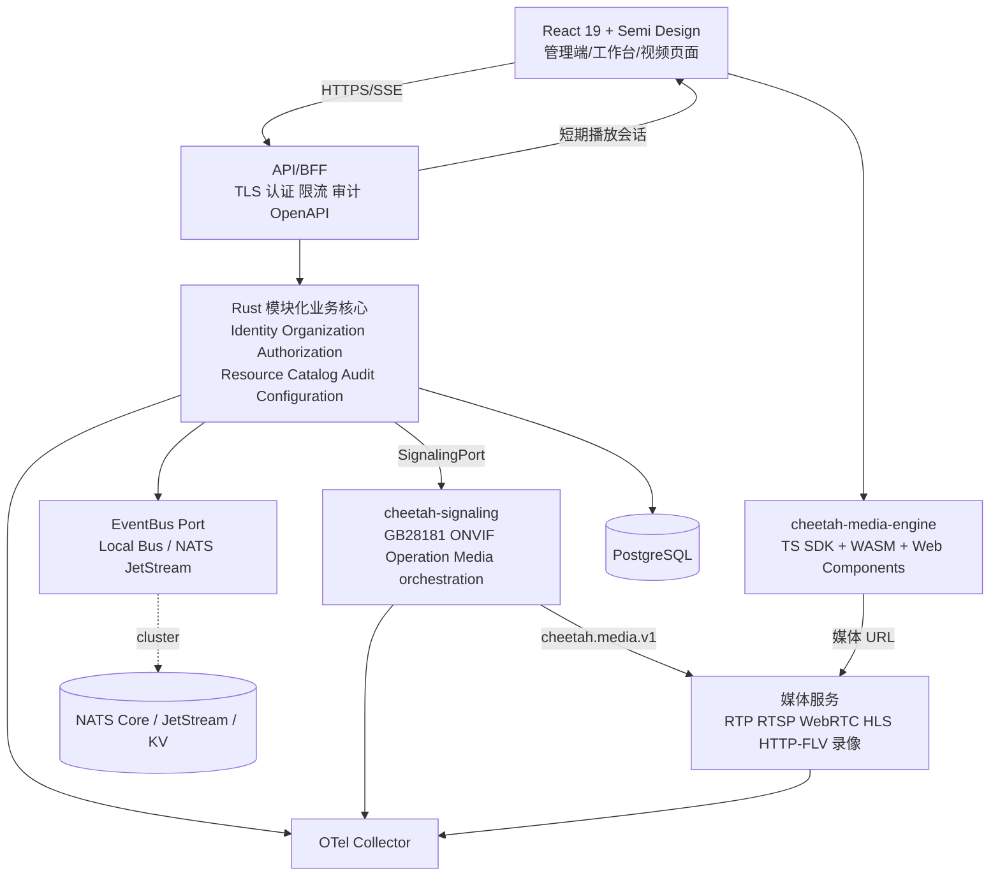
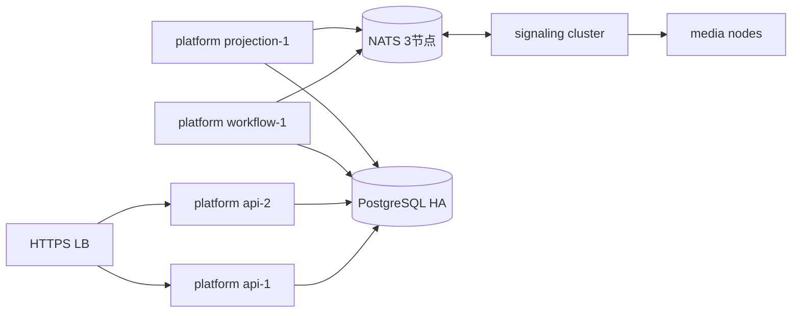
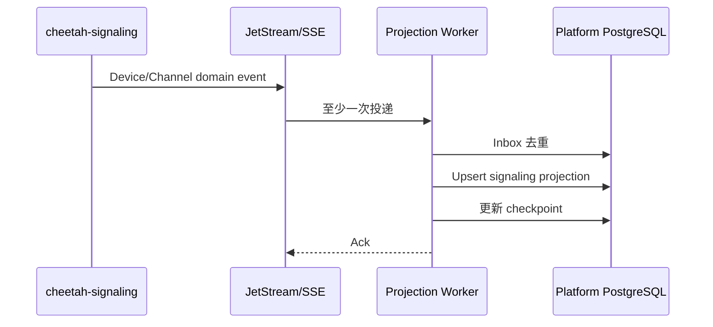
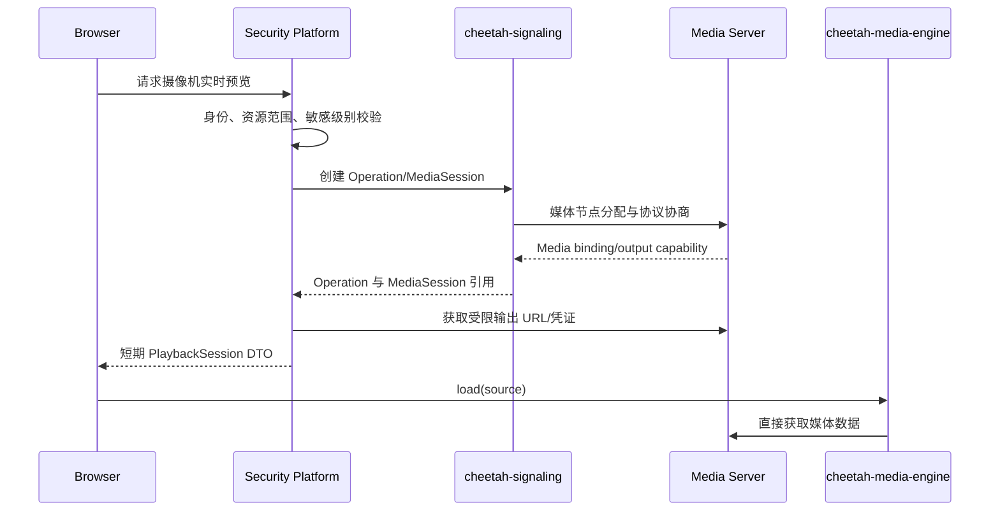

# 基于 Rust 的模块化综合安防管理平台系统设计方案

**文档版本：** V1.0  
**文档状态：** 正式设计基线  
**编制日期：** 2026-07-22  
**系统代号：** Cloud Leopard Secure Center  
**首期目标：** 完成管理核心闭环和可演进架构，不在首期实现信令、媒体和插件运行时  
**上游研究基线：** `cheetah-signaling@cfe35952`、`cheetah-media-engine@49531f6f`

---

## 1. 执行摘要

本系统是一套面向园区、学校、医院、工业、商业综合体和社区等场景的综合安防管理基础平台。平台首先建设稳定、可复用的管理核心，再通过信令接入、媒体服务、行业插件和产品能力包扩展，而不是为每个行业复制一套系统。

总体架构采用：

```text
React 管理端
    +
Rust 模块化业务单体
    +
独立 cheetah-signaling 信令控制面
    +
独立媒体数据平面
    +
PostgreSQL / NATS / OpenTelemetry
```

其中“单体”只指安防业务控制面的部署形态。设备长连接、GB/T 28181、ONVIF、媒体收发和浏览器播放器具有不同的故障、资源和扩容特征，因此始终保持独立边界。

### 1.1 第一阶段交付范围

第一阶段必须形成以下可独立验收的管理闭环：

- 租户、组织、场所和空间树；
- 用户、本地认证、会话和服务账号；
- 角色、权限、角色绑定和资源范围；
- 逻辑设备、摄像机、标签和外部资源绑定；
- 系统配置、审计日志和操作追踪；
- React + Semi Design 管理端壳、登录、组织、用户、权限、设备和审计页面；
- PostgreSQL migration、统一错误、OpenAPI、日志、指标和健康检查；
- 为 signaling、媒体、播放器和插件预先冻结端口与数据所有权边界。

第一阶段不实现：

- GB/T 28181、ONVIF 或厂商 SDK 的实际接入；
- 实时预览、录像检索、回放和转码；
- Wasmtime 插件执行、插件商店或运行期前端插件；
- NATS 集群、多角色拆分和跨区域调度；
- 告警联动、门禁、访客、AI 分析等行业业务。

这些能力在后续阶段接入，但第一阶段的数据模型不得阻碍其实现。

### 1.2 核心成功标准

1. 单个业务二进制可以完成第一阶段全部管理功能。
2. 所有租户数据访问同时受应用层条件和 PostgreSQL RLS 约束。
3. 领域模块不依赖 Axum、SQLx、NATS 或 signaling 的具体实现。
4. 设备业务资产与 signaling 协议资源不存在双主数据。
5. 同一代码库可以在后续通过角色配置拆分为多实例，而不修改领域语义。
6. 公开 API、数据库、事件和外部集成均有版本、幂等和兼容规则。

---

## 2. 建设目标与设计原则

### 2.1 业务目标

- 建立统一的租户、用户、组织、角色和资源权限体系；
- 建立与协议无关的设备和视频资源目录；
- 允许同一资源关联 GB/T 28181、ONVIF、厂商平台等多个外部身份；
- 为实时视频、录像、告警、门禁、访客和 AI 事件提供统一业务入口；
- 支持按行业能力包组合产品，不以代码分支制造不同版本；
- 支持小型私有化单机部署和大型中心/区域/边缘集群；
- 支持全离线安装、升级、备份和恢复。

### 2.2 质量目标

- 安全默认拒绝、最小权限、租户强隔离；
- 所有外部调用有 deadline、取消、限流和稳定错误；
- 所有异步副作用可追踪、幂等、可补偿；
- 所有集合、队列、缓存、分页和重试均有上限；
- 核心领域无框架依赖，可用单元测试验证；
- 公开契约按兼容扩展演进；
- 插件或设备接入故障不拖垮业务核心；
- 媒体负载不经过普通业务 API。

### 2.3 不可违反的设计原则

#### 核心稳定，外围开放

身份、组织、授权、业务资源、审计和配置属于稳定核心。行业规则、厂商协议、媒体能力和 UI 扩展位于稳定端口之外。

#### 控制面与媒体数据平面分离

业务平台和 signaling 可以处理身份、权限、资源、操作和媒体协商，但不得收发、解析或存储 RTP、RTCP、PS、TS、ES 等媒体负载。浏览器直接连接媒体服务。

#### 数据只有一个权威所有者

同一状态只能有一个系统负责写入。跨系统通过 ID 绑定、事件投影和查询接口协作，不共享表、不跨库事务、不双向同步同一字段。

#### 端口优先

领域代码依赖 `Repository`、`EventBus`、`SignalingPort`、`AuthorizationPort` 等抽象；单机和集群差异只存在于适配器和装配层。

#### API 优先

- 浏览器与外部系统：REST/OpenAPI；
- 进程间同步控制：gRPC/Protobuf；
- 持久异步消息：NATS JetStream + Protobuf envelope；
- 临时 request/reply：NATS Core 或 gRPC；
- 节点租约和能力快照：NATS KV；
- Wasm 宿主边界：WIT Component Model。

---

## 3. 冻结的架构决策

| 编号 | 决策 | 说明 |
| --- | --- | --- |
| ADR-001 | 平台核心采用 Rust 模块化单体 | 首期减少分布式复杂度，领域边界按未来拆分设计 |
| ADR-002 | signaling 与媒体始终独立进程 | 长连接、协议状态和媒体资源需要独立故障域 |
| ADR-003 | 平台所有形态统一使用 PostgreSQL | 不为平台核心维护 SQLite/PostgreSQL 双实现 |
| ADR-004 | 单机使用进程内业务总线 | 首期不强制部署 NATS；跨进程仍使用版本化接口 |
| ADR-005 | 集群使用 NATS Core、JetStream、KV | 与 cheetah-signaling 采用相同消息集群技术栈 |
| ADR-006 | 前端采用 React 19 + Semi Design | Semi 官方组件库以 React 为基础；播放器框架无关 |
| ADR-007 | V1 授权为 RBAC + Resource Scope | ABAC 通过稳定端口预留，Cedar 延后引入 |
| ADR-008 | UUIDv7 + revision | 内部标识可排序，所有可变聚合使用乐观并发 |
| ADR-009 | 共享数据库、按领域 schema 隔离 | 模块只写自己的 schema，跨模块经 application port |
| ADR-010 | 平台不复制 signaling 运行状态机 | Operation、MediaSession、MediaBinding 和 owner 归 signaling |

如需改变以上决策，必须新增 ADR，说明兼容、迁移、运维和回滚影响。

---

## 4. 总体架构

### 4.1 逻辑架构



### 4.2 后端分层

```text
apps / assembly
    配置、角色装配、依赖注入、进程生命周期
        ↓
transport adapters
    Axum、Tonic、SQLx、NATS、Secret Provider、Signaling Client
        ↓
application
    用例、事务边界、权限检查、投影、工作流、Outbox
        ↓
domain
    聚合、值对象、状态机、领域服务、端口
        ↓
foundation
    ID、时间、错误、分页、上下文、事件 envelope
```

依赖只能向下，或指向下层定义的抽象端口。禁止：

- domain 依赖 Tokio、Axum、SQLx、NATS、Tonic；
- HTTP DTO、SQL row 或 Protobuf message 直接充当领域实体；
- application 持有 SQL connection 或 NATS client；
- 业务模块直接读取其他模块的表；
- video-control 直接访问 signaling 或媒体服务内部对象；
- 前端把菜单隐藏当作权限控制。

### 4.3 建议工程结构

```text
cloud-leopard-secure-center/
├── Cargo.toml
├── rust-toolchain.toml
├── apps/
│   ├── security-platform/
│   └── migration-cli/
├── crates/
│   ├── foundation/
│   ├── domain-identity/
│   ├── domain-organization/
│   ├── domain-authorization/
│   ├── domain-resource/
│   ├── domain-audit/
│   ├── domain-configuration/
│   ├── application/
│   ├── storage-api/
│   ├── storage-postgres/
│   ├── message-api/
│   ├── message-local/
│   ├── message-nats/
│   ├── signaling-api/
│   ├── signaling-client/
│   ├── http-api/
│   └── observability/
├── proto/security/
├── migrations/
├── web/
├── deploy/
└── docs/
```

crate 的物理数量可在首期合并，但上述依赖方向必须通过架构测试保持。

---

## 5. 部署模型与演进

### 5.1 单机管理核心

```text
Browser
   │
security-platform --roles=all
   ├── local bounded bus
   └── PostgreSQL
```

这是第一阶段唯一必须交付的形态。PostgreSQL 可与平台一起通过 Compose 安装，也可使用客户已有实例。

### 5.2 单机完整安防套件

```text
security-platform --roles=all ── PostgreSQL
        │ REST/gRPC/SSE
cheetah-signaling --profile=edge ── SQLite/local bus
        │ gRPC/UDS
media-server
        ▲
Browser + cheetah-media-engine
```

signaling 的 edge 存储是其私有权威数据，不与平台 PostgreSQL 合并。安装包可以统一，但进程和故障域保持分离。

### 5.3 标准集群



平台与 signaling 可使用同一 PostgreSQL 服务和 NATS 集群，但必须使用：

- 独立数据库或独立 schema owner；
- 独立 NATS account/credentials；
- 独立 stream、subject 和 KV bucket；
- 最小 subject ACL；
- 独立 migration 生命周期。

### 5.4 平台角色

| 角色 | 职责 | 可水平扩展 |
| --- | --- | --- |
| `api` | REST、SSE、鉴权、查询、命令受理 | 是 |
| `workflow` | Outbox、异步任务、补偿、reconciler | 是，需抢占租约 |
| `projection` | 消费 signaling/业务事件并更新读模型 | 是，durable consumer 分组 |
| `scheduler` | 定时任务、数据保留和分区维护 | 主备或分片 |
| `plugin-host` | 后续管理 Wasm 与进程插件 | 是 |
| `all` | 合并以上平台角色 | 单机默认 |

同一角色在单机和集群下调用相同 application service，仅 adapter 不同。

---

## 6. 核心模块

### 6.1 Identity

负责用户、密码凭据、MFA、会话、服务账号、API key 和外部 OIDC 身份映射。

首期采用短期 access token 和可撤销 refresh session：

- access token 只携带 subject、tenant、session version 和粗粒度声明；
- 设备和组织资源范围不写入 token；
- refresh token 仅保存哈希，轮换时使旧 token 失效；
- 密码使用 Argon2id，参数可配置并记录算法版本；
- 高风险操作预留 MFA assurance level；
- 服务账号必须限制 scope、来源和过期时间。

### 6.2 Organization

负责租户、组织树和空间树。组织表达管理关系，空间表达物理位置，二者不得混用。

```text
Tenant
├── OrganizationUnit
│   └── OrganizationUnit ...
└── Site
    └── Building
        └── Floor
            └── Area
```

设备可以同时关联一个管理组织和一个物理区域。

### 6.3 Authorization

V1 使用：

```text
RBAC + RoleBinding + ResourceScope
```

权限 key 采用稳定命名：

```text
identity.user.read
identity.user.manage
organization.unit.manage
resource.device.read
resource.device.manage
video.live.play
video.recording.play
video.ptz.control
audit.record.read
system.setting.manage
```

授权请求统一为：

```json
{
  "principal_id": "019...",
  "tenant_id": "019...",
  "action": "resource.device.read",
  "resource": {
    "type": "managed-device",
    "id": "019...",
    "organization_unit_id": "019...",
    "area_id": "019..."
  },
  "context": {
    "request_id": "019...",
    "client_ip": "10.0.0.8",
    "mfa_level": 1
  }
}
```

`AuthorizationPort` 返回 allow/deny、匹配策略 ID 和安全原因码。V1 不引入 Cedar，但接口不得暴露 RBAC 表结构，以便后续增加 ABAC。

### 6.4 Resource Catalog

负责用户可见的业务资产，而不是协议运行状态：

- 逻辑设备和设备分类；
- 摄像机资源；
- 组织、区域、标签和负责人关系；
- signaling 或第三方平台的外部资源绑定；
- 外部通道、能力、在线状态的本地只读投影；
- 投影新鲜度和同步错误。

### 6.5 Audit

记录身份、权限、资源和配置的安全相关操作。审计记录追加写，不允许业务角色更新或删除。

### 6.6 Configuration

管理平台级、租户级和模块级配置。配置采用白名单 schema，不允许把任意 JSON 当成运行参数。密钥字段只保存 secret reference。

### 6.7 后续模块

- `video-control`：播放授权、业务播放会话和审计；
- `alarm-center`：统一告警、处置和证据；
- `plugin-manager`：插件安装、验签、授权和升级；
- `product-profile`：行业产品能力组合；
- `notification`：站内、短信、邮件和 webhook；
- `task-scheduler`：有界、可恢复的后台任务。

---

## 7. 领域模型

### 7.1 通用类型

所有 ID 均为受校验 UUIDv7 newtype，不跨概念复用裸字符串：

```rust
TenantId
OrganizationUnitId
SiteId
AreaId
UserId
SessionId
RoleId
RoleBindingId
ManagedDeviceId
CameraId
ExternalBindingId
AuditRecordId
```

通用值对象：

```text
Revision(u64)
UtcTimestamp
ResourceRef { resource_type, resource_id }
PageCursor
RequestContext { request_id, trace_context, actor, tenant_id }
ExternalResourceRef { system, resource_type, external_id, external_revision }
```

不得使用 UUID 的时间顺序进行授权或安全判断。

### 7.2 Tenant 聚合

```text
Tenant {
  tenant_id,
  code,
  display_name,
  status: Active | Suspended | Closed,
  default_locale,
  default_timezone,
  revision,
  created_at,
  updated_at
}
```

不变量：

- `code` 全平台唯一且创建后不可修改；
- Suspended 租户不能创建新会话或执行设备控制；
- Closed 为终态，只能通过受审计的数据恢复流程处理；
- 租户状态改变必须递增 revision 并产生领域事件。

### 7.3 OrganizationUnit 聚合

```text
OrganizationUnit {
  organization_unit_id,
  tenant_id,
  parent_id?,
  code,
  name,
  kind,
  enabled,
  sort_order,
  revision
}
```

不变量：

- 不能把节点移动到自身或后代之下；
- 同一父节点下有效 `code` 唯一；
- 删除前必须确认无有效子节点和强依赖资源；
- 移动节点与 closure table 更新在同一事务完成。

### 7.4 User 聚合

```text
User {
  user_id,
  tenant_id,
  username,
  display_name,
  status: Pending | Active | Locked | Disabled,
  primary_org_unit_id?,
  session_version,
  revision
}
```

密码、OIDC subject 和 MFA 方法作为独立实体；User 不持有明文凭据。

### 7.5 Role 与 RoleBinding

Role 是租户内权限集合；内置角色可锁定部分字段，但不通过硬编码绕过授权中心。

```text
RoleBinding {
  role_binding_id,
  tenant_id,
  principal_id,
  role_id,
  scope_type: Tenant | OrganizationSubtree | AreaSubtree | ResourceSet,
  scope_ref?,
  valid_from?,
  valid_until?,
  revision
}
```

一个授权结果必须同时满足角色包含 action、绑定有效、资源位于 scope 内。

### 7.6 ManagedDevice 聚合

```text
ManagedDevice {
  managed_device_id,
  tenant_id,
  name,
  category,
  manufacturer?,
  model?,
  serial_number?,
  management_org_unit_id?,
  area_id?,
  lifecycle: Draft | Active | Disabled | Retired,
  revision
}
```

它表达业务资产，不保存 signaling owner、SIP dialog、ONVIF token 或媒体 session。

### 7.7 Camera 实体

Camera 是可授权的视频业务资源，可以属于 IPC，也可以对应 NVR 的一个通道。

```text
Camera {
  camera_id,
  tenant_id,
  managed_device_id?,
  name,
  purpose?,
  area_id?,
  sensitivity: Normal | Restricted | HighlyRestricted,
  enabled,
  revision
}
```

一个 Camera 可以绑定多个外部来源，但任一时刻只能有一个首选 live source 和一个首选 playback source。

### 7.8 ExternalResourceBinding

```text
ExternalResourceBinding {
  binding_id,
  tenant_id,
  local_resource_ref,
  external_system: CheetahSignaling | VendorPlatform | Other,
  external_resource_type,
  external_resource_id,
  purpose: Primary | Alternate | Playback | Metadata,
  status: Pending | Active | Stale | Conflict | Disabled,
  last_synced_at?,
  external_revision?,
  revision
}
```

唯一约束保证同一外部资源不能同时绑定到多个有效本地资源。冲突必须进入显式状态，禁止最后写入者静默覆盖。

### 7.9 外部资源投影

`SignalingDeviceProjection` 和 `SignalingChannelProjection` 是可丢弃、可重建的读模型：

- 保留上游 ID、名称、能力摘要、在线摘要和事件游标；
- 所有 API 返回 `observed_at`、`source_event_id` 和 `stale`；
- 投影延迟不改变平台业务资产；
- 删除上游资源先标记 missing，经过保留窗口后再清理投影。

### 7.10 业务播放授权（后续）

平台后续只拥有 `PlaybackEntitlement`，不拥有 signaling MediaSession 状态机：

```text
PlaybackEntitlement {
  entitlement_id,
  tenant_id,
  principal_id,
  camera_id,
  mode: Live | Playback | Download,
  allowed_actions,
  signaling_operation_id?,
  signaling_media_session_id?,
  expires_at,
  revoked_at?
}
```

---

## 8. 数据所有权与一致性

### 8.1 权威所有者矩阵

| 数据 | 权威所有者 | 平台中的形态 |
| --- | --- | --- |
| 租户、组织、用户、角色 | security-platform | 权威聚合 |
| 逻辑设备、摄像机、区域归属 | security-platform | 权威聚合 |
| 协议身份、endpoint、设备 owner | cheetah-signaling | 外部绑定/投影 |
| signaling Operation | cheetah-signaling | ID 引用/查询缓存 |
| MediaSession、MediaBinding | cheetah-signaling | ID 引用/状态投影 |
| 流、RTP 端口、录像文件 | media server/storage | 元数据引用 |
| 浏览器播放状态 | cheetah-media-engine | 页面临时状态 |
| 告警处置、业务审计 | security-platform | 权威聚合 |

### 8.2 一致性规则

- 平台事务只覆盖平台 PostgreSQL；
- 聚合变更和 Outbox 写入同事务提交；
- 跨系统副作用使用 idempotency key、Operation、事件和 reconciler；
- 不宣称数据库、NATS、设备和媒体之间端到端 exactly-once；
- JetStream 语义为至少一次，消费者必须使用 Inbox 去重；
- 查询投影允许最终一致，但响应必须暴露新鲜度；
- 设备控制类写操作不因超时自动判定失败，无法确认结果时返回 `UNKNOWN_OUTCOME`。

---

## 9. PostgreSQL 数据库设计

### 9.1 Schema 划分

```text
iam.*       用户、凭据、会话、服务账号
org.*       租户、组织、场所和空间
authz.*     角色、权限、绑定和资源集合
resource.*  业务设备、摄像机、外部绑定和投影
audit.*     审计记录
config.*    配置定义和值
infra.*     outbox、inbox、幂等、任务和节点
alarm.*     后续告警领域
plugin.*    后续插件管理
```

每个模块使用独立数据库 owner；运行账号仅获得所需 schema 权限。跨 schema 读写只能由明确的 application use case 和 UnitOfWork 完成。

### 9.2 通用列规范

权威租户表默认包含：

```text
tenant_id      uuid        not null
<entity>_id    uuid        not null
revision       bigint      not null default 0
created_at     timestamptz not null
created_by     uuid        null
updated_at     timestamptz not null
updated_by     uuid        null
deleted_at     timestamptz null
```

规则：

- 所有时间使用 UTC `timestamptz`；
- 业务更新使用 `WHERE id = $id AND revision = $expected`；
- 零行更新映射为 `REVISION_CONFLICT`；
- 软删除资源的唯一索引使用 `WHERE deleted_at IS NULL`；
- 状态以小写稳定字符串保存，应用 enum 与数据库 CHECK 同步；
- 金额、时长、容量等字段名携带单位；
- JSONB 扩展必须同时包含 `schema_version` 并限制序列化大小。

### 9.3 租户和组织表

| 表 | 关键字段 | 约束与索引 |
| --- | --- | --- |
| `org.tenants` | `tenant_id, code, display_name, status, locale, timezone, revision` | PK `tenant_id`；有效 `code` 全局唯一 |
| `org.organization_units` | `organization_unit_id, tenant_id, parent_id, code, name, kind, enabled, sort_order, revision` | FK parent 同租户；有效 `(tenant_id,parent_id,code)` 唯一 |
| `org.organization_unit_closure` | `tenant_id, ancestor_id, descendant_id, depth` | 复合 PK；索引 `(tenant_id,descendant_id,depth)` |
| `org.sites` | `site_id, tenant_id, code, name, address, geo_point, revision` | 有效 `(tenant_id,code)` 唯一 |
| `org.buildings` | `building_id, tenant_id, site_id, code, name, revision` | `(tenant_id,site_id,code)` 唯一 |
| `org.floors` | `floor_id, tenant_id, building_id, code, name, floor_number, revision` | `(tenant_id,building_id,code)` 唯一 |
| `org.areas` | `area_id, tenant_id, parent_area_id, site_id, kind, code, name, revision` | 同租户父子 FK；区域路径索引 |
| `org.area_closure` | `tenant_id, ancestor_id, descendant_id, depth` | 复合 PK；支持资源范围判断 |

closure 表在创建、移动和删除树节点时与实体表同事务更新。禁止用递归逐条查询完成每次授权判断。

### 9.4 身份表

| 表 | 关键字段 | 约束与索引 |
| --- | --- | --- |
| `iam.users` | `user_id, tenant_id, username, display_name, status, primary_org_unit_id, session_version, revision` | 有效 `(tenant_id,lower(username))` 唯一 |
| `iam.user_identities` | `identity_id, tenant_id, user_id, provider, subject, email` | `(tenant_id,provider,subject)` 唯一 |
| `iam.password_credentials` | `user_id, password_hash, algorithm, parameters, changed_at, expires_at` | 不记录明文；仅凭据服务可读 |
| `iam.mfa_methods` | `mfa_method_id, user_id, kind, secret_ref, status, verified_at` | secret 仅保存引用 |
| `iam.sessions` | `session_id, tenant_id, user_id, refresh_token_hash, token_family_id, expires_at, revoked_at, client` | token hash 唯一；用户和过期索引 |
| `iam.service_accounts` | `service_account_id, tenant_id, name, status, expires_at, revision` | `(tenant_id,name)` 唯一 |
| `iam.api_keys` | `api_key_id, service_account_id, key_prefix, key_hash, scopes, expires_at, revoked_at` | `key_prefix` 索引；不保存原 key |
| `iam.login_attempts` | `attempt_id, tenant_id?, username_hash, source_ip, result, occurred_at` | 按月分区；保留期限配置化 |

### 9.5 授权表

| 表 | 关键字段 | 约束与索引 |
| --- | --- | --- |
| `authz.permissions` | `permission_id, permission_key, resource_type, description` | `permission_key` 全局唯一 |
| `authz.roles` | `role_id, tenant_id, code, name, built_in, revision` | 有效 `(tenant_id,code)` 唯一 |
| `authz.role_permissions` | `tenant_id, role_id, permission_id` | 复合 PK |
| `authz.role_bindings` | `role_binding_id, tenant_id, principal_type, principal_id, role_id, scope_type, scope_ref, valid_from, valid_until, revision` | principal、role、有效期查询索引 |
| `authz.resource_sets` | `resource_set_id, tenant_id, name, revision` | `(tenant_id,name)` 唯一 |
| `authz.resource_set_members` | `tenant_id, resource_set_id, resource_type, resource_id` | 复合 PK；资源反向索引 |
| `authz.policy_documents` | `policy_id, tenant_id, language, document, status, version` | 为后续 ABAC 预留，V1 不执行 |

角色绑定不复制 closure 展开结果。授权查询使用 scope_ref 连接组织/区域 closure 或资源集合。

### 9.6 资源目录表

| 表 | 关键字段 | 约束与索引 |
| --- | --- | --- |
| `resource.managed_devices` | `managed_device_id, tenant_id, name, category, manufacturer, model, serial_number, org_unit_id, area_id, lifecycle, revision` | tenant/lifecycle、org、area 索引 |
| `resource.cameras` | `camera_id, tenant_id, managed_device_id?, name, area_id, sensitivity, enabled, revision` | tenant/area、device 索引 |
| `resource.tags` | `tag_id, tenant_id, key, value, color` | `(tenant_id,key,value)` 唯一 |
| `resource.resource_tags` | `tenant_id, resource_type, resource_id, tag_id` | 复合 PK；tag 反向索引 |
| `resource.external_bindings` | `binding_id, tenant_id, local_type, local_id, external_system, external_type, external_id, purpose, status, external_revision, last_synced_at, revision` | 有效外部 ref 唯一；本地资源索引 |
| `resource.signaling_devices` | `tenant_id, signaling_device_id, name, kind, capabilities, online_state, observed_at, source_event_id, source_sequence` | 投影 PK；`observed_at` 索引 |
| `resource.signaling_channels` | `tenant_id, signaling_channel_id, signaling_device_id, name, kind, capabilities, online_state, observed_at, source_event_id, source_sequence` | device/channel 索引 |
| `resource.projection_checkpoints` | `projection_name, partition_key, last_event_id, last_sequence, updated_at` | 复合 PK |
| `resource.projection_failures` | `failure_id, projection_name, event_id, reason, attempts, next_retry_at, payload_ref` | retry 和 dead-letter 索引 |

投影表不允许用户 API 直接修改。重新构建时写入 shadow 表，校验完成后切换读取视图，避免长时间空窗。

### 9.7 配置和审计表

| 表 | 关键字段 | 约束与索引 |
| --- | --- | --- |
| `config.definitions` | `config_key, value_type, schema, default_value, sensitive, dynamic` | `config_key` PK |
| `config.values` | `config_value_id, tenant_id?, scope_type, scope_id?, config_key, value, secret_ref?, revision` | scope + key 唯一；敏感值禁止写 `value` |
| `audit.records` | `audit_record_id, tenant_id, actor_type, actor_id, action, target_type, target_id, result, request_id, trace_id, source_ip, before_digest, after_digest, occurred_at, details` | 按 `occurred_at` 月分区；tenant/time 索引 |

审计表由专用数据库角色写入，拒绝 UPDATE/DELETE；普通业务账号无表级写权限。

### 9.8 基础设施表

| 表 | 关键字段 | 约束与索引 |
| --- | --- | --- |
| `infra.outbox_messages` | `message_id, tenant_id, aggregate_type, aggregate_id, aggregate_sequence, event_type, payload, occurred_at, available_at, attempts, published_at` | 未发布 partial index |
| `infra.inbox_messages` | `consumer_name, message_id, tenant_id, status, result_digest, processed_at, expires_at` | `(consumer_name,message_id)` PK；过期索引 |
| `infra.idempotency_records` | `tenant_id, principal_id, endpoint_scope, idempotency_key, request_digest, response_status, response_body, expires_at` | 复合唯一；过期索引 |
| `infra.jobs` | `job_id, tenant_id?, kind, status, payload, lease_owner, lease_until, attempts, next_run_at, revision` | runnable partial index |
| `infra.nodes` | `node_id, roles, zone, status, build_version, capabilities, lease_until, revision` | role/zone/lease 索引 |
| `infra.schema_metadata` | `component, schema_version, applied_at, build_version` | component/version 唯一 |

### 9.9 RLS 策略

租户表启用并强制 RLS：

```sql
ALTER TABLE resource.managed_devices ENABLE ROW LEVEL SECURITY;
ALTER TABLE resource.managed_devices FORCE ROW LEVEL SECURITY;

CREATE POLICY tenant_isolation ON resource.managed_devices
USING (tenant_id = current_setting('app.tenant_id', true)::uuid)
WITH CHECK (tenant_id = current_setting('app.tenant_id', true)::uuid);
```

每个租户事务必须：

1. 从已验证 token 和 path 同时解析 tenant；
2. 确认二者一致；
3. 开启 SQL transaction；
4. 执行 `SET LOCAL app.tenant_id = ...`；
5. 在同一 transaction 内完成查询或修改；
6. 提交或回滚后归还连接。

禁止在连接池连接上使用非 LOCAL session 变量。平台级操作使用单独数据库角色，并生成强制审计。

### 9.10 数据保留与分区

- `audit.records`、`iam.login_attempts` 按月分区；
- 告警、通知和大量事件表在对应阶段按月或租户层级分区；
- Outbox 发布完成后按配置保留 7～30 天；
- Inbox 保留时间不得短于上游最大重投/重放窗口；
- 投影失败 payload 使用对象存储引用，避免数据库保存无界消息；
- 清理任务分批执行，禁止长事务一次删除大量行。

### 9.11 迁移策略

```text
expand   增加兼容列、表和索引
backfill 可暂停、可恢复、有限批次回填
switch   切换读写路径
contract 下一发布窗口删除旧结构
```

启动时只自动执行短时、向后兼容的 expand migration。长回填、并发索引和 contract 必须由 migration CLI 显式执行。

---

## 10. REST API 规范

### 10.1 资源路径

```text
/api/v1/tenants
/api/v1/tenants/{tenant_id}
/api/v1/tenants/{tenant_id}/organization-units
/api/v1/tenants/{tenant_id}/sites
/api/v1/tenants/{tenant_id}/areas
/api/v1/tenants/{tenant_id}/users
/api/v1/tenants/{tenant_id}/roles
/api/v1/tenants/{tenant_id}/role-bindings
/api/v1/tenants/{tenant_id}/devices
/api/v1/tenants/{tenant_id}/cameras
/api/v1/tenants/{tenant_id}/audit-records
/api/v1/tenants/{tenant_id}/settings
```

后续增加：

```text
/api/v1/tenants/{tenant_id}/video/playback-entitlements
/api/v1/tenants/{tenant_id}/alarms
/api/v1/tenants/{tenant_id}/plugins
```

### 10.2 通用规则

- OpenAPI 3.1 是公开 REST 契约的权威来源；
- 创建返回 `201 Created`；长操作返回 `202 Accepted`；
- 更新使用 `If-Match`/ETag 携带 revision；
- 写请求支持 `Idempotency-Key`；
- 列表使用不透明 cursor 和稳定排序，不使用深 offset；
- 时间为 RFC 3339 UTC；duration 字段显式以 `_ms` 结尾；
- tenant path 必须与 token scope 一致；
- 请求、响应和上传大小都有配置上限。

### 10.3 错误格式

采用 RFC 9457 `application/problem+json`：

```json
{
  "type": "https://errors.cloud-leopard.example/revision-conflict",
  "title": "Revision conflict",
  "status": 409,
  "code": "REVISION_CONFLICT",
  "detail": "The resource was modified by another request.",
  "request_id": "019...",
  "retryable": false,
  "violations": []
}
```

稳定错误至少包括：

```text
INVALID_ARGUMENT, UNAUTHENTICATED, PERMISSION_DENIED,
NOT_FOUND, ALREADY_EXISTS, REVISION_CONFLICT,
IDEMPOTENCY_CONFLICT, RATE_LIMITED, TIMEOUT,
CANCELLED, UNAVAILABLE, UNSUPPORTED, VERSION_MISMATCH,
UNKNOWN_OUTCOME, INTERNAL
```

内部 SQL、栈回溯、节点地址和 secret 不得进入响应。

---

## 11. 事件与集群通信

### 11.1 Envelope

平台事件使用版本化 Protobuf，至少包含：

```text
message_id
tenant_id
correlation_id
causation_id
occurred_at
deadline
source_node_id
aggregate_ref
aggregate_sequence
traceparent / tracestate
typed payload
```

所有 enum 的 0 值为 `*_UNSPECIFIED`；删除字段必须 `reserved`；字段号不复用；核心命令禁止用 `Any` 逃避建模。

### 11.2 NATS 命名

```text
security.v1.command.{tenant_bucket}.{role_or_node}
security.v1.event.{tenant_bucket}.{event_type}
```

```text
Streams:
  SECURITY_COMMANDS
  SECURITY_EVENTS

KV buckets:
  SECURITY_NODES
  SECURITY_CAPABILITIES
```

`tenant_bucket` 与 signaling 一样使用 tenant UUID 首字节的两位十六进制值，只用于有界分片，不替代 envelope 内的 tenant 校验。

平台消费 signaling 的既有 subject：

```text
sig.v1.event.{tenant_bucket}.{event_type}
```

平台不得向 signaling stream 发布自定义 JSON，也不得复用其 durable consumer 名称。

### 11.3 投递语义

- Producer 设置 `NATS-Msg-Id` 并等待 publish ack；
- Consumer 使用 durable pull、explicit ack 和有界 batch；
- 暂时错误 NAK 并退避；永久格式错误 TERM 并进入 dead-letter；
- 消费副作用前写 Inbox；
- 重放不得重复创建资产、审计或外部控制；
- stream/subject/durable/KV 名称属于运维 ABI，变更需要双写和迁移计划。

---

## 12. cheetah-signaling 融合设计

### 12.1 集成边界

平台定义 `SignalingPort`，application 不感知具体传输：

```rust
pub trait SignalingPort: Send + Sync {
    async fn get_device(&self, request: GetSignalingDevice)
        -> Result<SignalingDeviceSnapshot, SignalingError>;

    async fn create_operation(&self, request: CreateSignalingOperation)
        -> Result<ExternalOperationRef, SignalingError>;

    async fn create_media_session(&self, request: CreateMediaSession)
        -> Result<ExternalMediaSessionRef, SignalingError>;

    async fn get_operation(&self, operation_id: ExternalOperationId)
        -> Result<ExternalOperationSnapshot, SignalingError>;
}
```

这只是平台内部 port；wire 上复用 signaling 的公开 OpenAPI 和 `cheetah.*.v1` Protobuf，不复制一套竞争协议。

### 12.2 传输策略

| 场景 | 传输 |
| --- | --- |
| 设备/Operation/MediaSession 管理 | signaling 公开 REST/OpenAPI |
| 集群增量资源同步 | NATS JetStream Protobuf event |
| 单机增量资源同步 | SSE 或签名 Webhook adapter |
| signaling 到媒体节点 | 既有 `cheetah.media.v1` gRPC |
| 健康和能力协商 | REST/gRPC capability endpoint |

禁止平台直接调用 signaling 内部 repository、NATS 管理接口或 owner node 的私有 handler。

### 12.3 资源同步



首次接入或检测到 event gap 时，projection worker 通过 signaling 分页 API 执行全量 reconciliation，再从新 checkpoint 恢复增量事件。

### 12.4 标识映射

- 平台 `ManagedDeviceId` 与 signaling `DeviceId` 不假定相同；
- 平台 `CameraId` 与 signaling `ChannelId` 不假定相同；
- 映射只能通过 `external_bindings` 建立；
- 自动匹配只能产生 Pending 建议，必须按可信规则或人工确认转为 Active；
- serial、MAC、GB 编码和 ONVIF token 只能作为候选属性，不能直接充当平台主键。

### 12.5 失败与恢复

- signaling 不可用时，管理核心保持可用，协议投影标记 stale；
- 需要 signaling 的写操作返回 `UNAVAILABLE`，不得写入伪成功状态；
- 超时但可能已执行的设备命令返回 `UNKNOWN_OUTCOME`；
- 重复事件依赖 Inbox 和上游 aggregate sequence 幂等；
- 上游 sequence 回退或同序列不同 payload 进入 quarantine；
- 投影积压、重放和 reconciliation 都有独立指标与管理操作。

---

## 13. 视频与 Web 播放器集成

### 13.1 数据流



业务平台不代理媒体字节，也不把设备账号交给浏览器。

### 13.2 播放会话 DTO

```json
{
  "playback_session_id": "019...",
  "camera_id": "019...",
  "mode": "live",
  "expires_at": "2026-07-22T10:05:00Z",
  "signaling": {
    "operation_id": "019...",
    "media_session_id": "019..."
  },
  "sources": [
    {
      "profile": "sub",
      "protocol": "http-flv",
      "url": "https://media.example/...",
      "expires_at": "2026-07-22T10:05:00Z"
    }
  ],
  "player": {
    "latency_mode": "realtime",
    "fallback_enabled": true
  }
}
```

URL 中的 token 必须短期有效、与租户/摄像机/session 绑定、可撤销且不进入日志和诊断包。

### 13.3 cheetah-media-engine 适配

前端创建 `SecurityPlayer` 包装 `@cheetah-media/web`：

- 映射平台 `PlaybackSession` 到 `PlayerConfig` 和 `load`；
- 挂载/卸载时严格调用 `stop`、`destroy`；
- 统一处理 firstframe、backendchange、buffering、warning、error 和 stats；
- token 临近过期时向平台刷新会话，不把 refresh token 交给媒体服务；
- 主/子码流切换重新申请或选择授权 source；
- 多画面使用 `@cheetah-media/components` 或其预算器，不复制播放器管线；
- 诊断信息上传前再次清理 URL、header 和 token。

生产部署应自托管 Worker、Wasm 和 codec pack，并配置 CSP、SRI、COOP/COEP；无法启用 cross-origin isolation 时明确降低多画面和软解容量预期。

---

## 14. 前端架构

### 14.1 技术基线

```text
React 19
TypeScript 7
Vite 8
Semi Design 2.x
React Router
TanStack Query
Zustand
Vitest + Testing Library + Playwright
```

依赖版本通过 lockfile 固定，升级必须经过浏览器、组件和播放器回归测试。

### 14.2 分层

```text
app shell
  路由、主题、i18n、错误边界、会话
features
  organization / users / authorization / resources / audit / video
entities
  稳定业务类型、query key、表单 schema
shared
  API client、Semi 封装、权限组件、播放器适配、工具
```

服务器状态由 TanStack Query 管理；仅页面偏好、布局和临时交互状态进入 Zustand。禁止把所有 API 数据复制到全局 store。

### 14.3 权限和路由

- 路由 meta 声明所需 permission；
- 菜单根据服务端 capability 和 permission 生成；
- 按钮级权限只改善 UX，服务端仍执行完整授权；
- 403、资源被回收和 session 过期必须有统一处理；
- 租户切换清空 tenant-scoped query cache 和临时播放器。

### 14.4 首期页面

- 登录、退出和会话过期；
- 总体工作台占位与系统健康；
- 组织树、场所和区域；
- 用户、角色、权限和资源范围；
- 设备、摄像机、标签和绑定状态；
- 审计检索与详情；
- 系统和租户配置。

### 14.5 扩展策略

首期使用 monorepo 和构建期 feature 注册。后续插件扩展点包括 menu、route、dashboard-widget、device-detail-tab、alarm-detail-panel、settings-page 和 toolbar-action。

远程模块只有在完成签名、SRI、CSP、版本协商、权限隔离和回滚后才能启用；首期不引入微前端。

---

## 15. 插件架构预留

插件分为：

| 类型 | 运行方式 | 用途 |
| --- | --- | --- |
| 核心模块 | 静态 Rust crate | 稳定公共业务 |
| Wasm 业务插件 | Wasmtime Component Model | 规则、转换、联动、校验 |
| 原生进程插件 | UDS/mTLS gRPC | 厂商 SDK、特殊协议、AI 服务 |
| 前端扩展 | 构建期，后续远程加载 | 行业页面和组件 |
| 产品能力包 | 声明式 manifest | 组合模块、插件、权限和默认配置 |

平台不提供 Rust 动态库 ABI。跨版本边界只允许 WIT、Protobuf、HTTP 或受控 C ABI。

后续 WIT 应保持小而稳定，仅暴露受控 host capability：配置读取、资源查询、告警创建、事件发布、结构化日志。默认禁止文件系统、任意网络、数据库和密钥枚举。

进程插件优先复用 signaling 的双向 gRPC handshake 思路：版本协商、instance、tenant/zone scope、credit、heartbeat、deadline、drain 和有界重放。

---

## 16. 安全设计

### 16.1 身份和授权

- 外部接口仅开放 HTTPS；内部跨主机使用 mTLS；
- access token 短期有效，refresh token 轮换和撤销；
- 所有 repository 操作显式携带 TenantId；
- 授权在 application use case 内执行，不能只依赖路由中间件；
- 录像导出、PTZ、开门等高风险操作要求二次确认或 MFA；
- 服务账号、API key 和插件身份均使用最小 scope。

### 16.2 Secret

业务表和普通配置不保存明文 secret。通过 `SecretProvider` 按引用访问 Vault/KMS、操作系统密钥服务或受控加密存储。

secret 类型不得实现会泄漏明文的 `Debug`/`Serialize`；日志、错误、事件、审计和诊断包不得包含密码、token、完整播放 URL 或 Authorization header。

### 16.3 应用安全

- 请求体、查询复杂度、分页和上传大小限制；
- SQL 参数化；
- URL scheme、目标地址、重定向和 DNS rebinding 检查；
- 防止路径穿越、SSRF、越权和租户串读；
- 登录前限流严于登录后；
- CORS 白名单，不使用生产通配符；
- 管理页面设置 CSP、frame-ancestors 和安全 cookie；
- 依赖、镜像、Wasm 和插件生成 SBOM 并签名。

### 16.4 威胁模型重点

- 通过 tenant path 越权读取其他租户；
- 利用投影 ID 混淆平台资源和 signaling 资源；
- 重放设备控制或播放 URL；
- 旧 owner epoch 回调推进新操作；
- 恶意插件读取凭据或制造事件风暴；
- 播放器诊断泄漏带 token URL；
- Webhook SSRF；
- 审计篡改或清理任务误删证据。

---

## 17. 可靠性与可观测性

### 17.1 超时、重试和取消

所有数据库、HTTP、gRPC、NATS、secret 和插件调用均有 connect timeout、operation deadline 和取消传播。

仅对状态查询、事件投递和有幂等保证的操作重试。开门、删除录像等无法证明幂等的副作用不得盲目自动重试。

### 17.2 背压

- 进程内 channel、NATS batch、Outbox batch 和 projection queue 均有上限；
- 队列满时按流量类别拒绝、退避或合并可重建状态；
- 告警和审计不得静默丢弃；
- 慢 SSE 客户端收到 gap 后重新查询；
- 任何后台循环都有 batch、deadline、jitter 和 cancellation。

### 17.3 健康检查

```text
/health/live   进程事件循环仍运行
/health/ready  当前角色可以履行职责
```

例如 API 节点在 PostgreSQL 不可用时不得 ready；projection 节点在其必需 consumer 无法恢复时不得 ready。非关键 OTLP 导出失败不影响业务 readiness。

### 17.4 遥测

统一使用 `tracing`，通过 OpenTelemetry/OTLP 输出 trace、metrics 和 logs。

结构化上下文字段：

```text
service, role, node_id, tenant_tier, request_id,
correlation_id, operation_id, resource_type,
action, result, error_code
```

tenant_id、user_id、device_id 等高基数字段不得作为 Prometheus label。

核心指标包括：

- HTTP 请求量、错误率和 P50/P95/P99；
- DB pool、慢查询、锁等待和复制延迟；
- Outbox backlog、publish failure、Inbox duplicate；
- JetStream consumer lag、redelivery 和 dead-letter；
- authorization latency 和 deny rate；
- projection lag、gap、rebuild 和 stale resource；
- signaling/media 调用延迟和错误分类；
- 播放首帧、buffering、backend fallback 和并发窗口；
- 登录失败、MFA 和敏感操作审计。

### 17.5 优雅停机

撤销 readiness → 停止新请求/租约 → 有界 drain → 停止拉取新消息 → 提交已完成 ack → 刷新 Outbox/遥测 → 关闭连接池。

---

## 18. 测试与验收

### 18.1 测试层次

- 领域单元测试：聚合不变量、状态机、权限范围；
- 属性测试：组织树移动、closure、授权继承、事件幂等；
- Repository contract：PostgreSQL 事务、revision、RLS、分页、迁移；
- API contract：OpenAPI、错误、ETag、幂等、租户越权；
- 消息 contract：重复、乱序、重投、dead-letter、consumer restart；
- signaling adapter：REST/SSE/JetStream 三种输入映射为相同平台类型；
- 浏览器测试：登录、权限、缓存清理、播放器生命周期；
- 故障测试：PostgreSQL/NATS/signaling 不可用、projection gap 和磁盘满。

### 18.2 第一阶段验收场景

1. 创建租户、组织树和区域树，移动节点后 closure 正确。
2. 创建用户、角色和组织子树范围，只能读取范围内设备。
3. 修改带旧 revision 的资源返回 409，不覆盖新数据。
4. 重放相同 Idempotency-Key 返回第一次结果；请求摘要不同时返回冲突。
5. 伪造 tenant path、token tenant 或数据库 session context 均不能跨租户读取。
6. 创建、修改、禁用用户/角色/设备/配置均产生不可修改审计。
7. signaling 不可用不影响组织和用户管理；投影状态明确显示 stale。
8. 服务重启后未发布 Outbox 可恢复，重复消费不重复应用。
9. 管理端切换租户后清除旧租户查询缓存和选中资源。
10. migration 能从空库创建，并从上一支持版本滚动升级和回滚二进制。

### 18.3 后续视频验收

- 同一实时预览幂等请求不会创建多个上游媒体会话；
- 未授权用户不能得到播放 URL；
- 播放 URL 过期、撤销和跨摄像机使用均失败；
- signaling owner 变化时旧 epoch 结果不推进新 session；
- cheetah-media-engine 能完成加载、首帧、fallback、停止和资源释放；
- 1/4/9/16 画面遵循主子码流和资源预算。

### 18.4 工程质量门禁

```text
cargo fmt --all -- --check
cargo clippy --workspace --all-targets -- -D warnings
cargo nextest run --workspace
cargo deny check
OpenAPI breaking check
Buf format/lint/breaking check
PostgreSQL migration + repository contract
pnpm typecheck/test/build
Playwright smoke tests
SBOM 和漏洞扫描
```

---

## 19. 实施路线图

### 阶段 0：工程与契约基线

- Cargo workspace、工具链和依赖治理；
- foundation 类型、错误、Clock、ID generator；
- Axum、SQLx、migration CLI 和配置；
- OpenAPI、健康检查、tracing/OTLP；
- React/Semi 管理端壳和 typed API client；
- 架构依赖测试和 CI。

**退出条件：** 空库可迁移，服务可启动，前端可登录到 mock/最小 API，质量门禁通过。

### 阶段 1：管理核心闭环

- Tenant、Organization、Identity、Authorization；
- ManagedDevice、Camera、Tag、ExternalBinding；
- Configuration、Audit、Outbox/Inbox；
- 管理页面和端到端权限场景；
- Compose、备份恢复和离线安装基础。

**退出条件：** 第 18.2 节全部通过，完成首期发布。

### 阶段 2：信令接入与视频闭环

- SignalingPort 和 cheetah-signaling adapter；
- 全量 reconciliation、增量投影和 gap 恢复；
- 播放授权、短期播放会话和审计；
- cheetah-media-engine 单画面和多画面适配；
- 实时预览、录像检索与回放。

**退出条件：** 第 18.3 节通过，媒体数据不经过平台 API。

### 阶段 3：事件、告警与插件

- NATS JetStream、集群 EventBus adapter；
- 告警中心、通知和联动；
- Wasmtime/WIT 插件、原生进程插件和 conformance kit；
- 前端构建期插件和产品能力包。

### 阶段 4：集群与区域化

- 多角色平台部署、节点租约和 drain；
- PostgreSQL HA、NATS 3 节点和灾备；
- 区域 signaling/media 节点、容量与网络成本调度；
- 滚动升级、灰度、故障注入和规模压测。

---

## 20. 性能与容量基线

第一阶段控制面建议验收基线：

| 指标 | 基线 |
| --- | ---: |
| 租户数 | 100 |
| 用户数 | 100,000 |
| 业务设备 | 100,000 |
| 摄像机资源 | 200,000 |
| 平台并发用户 | 1,000 |
| 普通 API P95 | < 300 ms |
| 授权决策 P95 | < 20 ms |
| 审计写入成功率 | 99.99% |
| Outbox 正常发布延迟 P95 | < 2 s |
| signaling 投影正常延迟 P95 | < 5 s |

容量报告必须同时给出硬件、数据库配置、请求组合、数据规模、缓存状态和测试持续时间，不能只报告单一峰值。

媒体容量单独压测，至少记录编码、分辨率、码率、协议、转码比例、浏览器能力、首帧和出口带宽。

---

## 21. 风险与应对

| 风险 | 应对 |
| --- | --- |
| 平台与 signaling 都存在 device/channel 概念 | 使用权威所有者矩阵、不同类型名和 ExternalBinding，禁止共享表 |
| 上游契约快速演进 | 固定 commit/tag，使用 adapter、contract test 和兼容窗口 |
| 首期过度微服务化 | 业务核心保持单二进制，仅保留角色边界 |
| RLS 与连接池上下文泄漏 | `SET LOCAL` + transaction、强制 RLS、跨租户测试 |
| 组织树移动造成大事务 | closure 分批评估、限制子树规模、明确维护窗口 |
| JetStream 重投产生重复副作用 | Outbox/Inbox、幂等键、fencing、reconciler |
| 播放 URL 泄漏 | 短期、绑定资源、可撤销、日志与诊断脱敏 |
| Wasm/WASI 演进 | 自维护小型版本化 WIT，不暴露完整 WASI |
| 前端远程插件扩大供应链风险 | 首期只构建期注册；后续签名、SRI、CSP 和回滚 |
| PostgreSQL 成为单机额外依赖 | 提供 Compose/离线包、备份工具和安装前检查 |

---

## 22. 术语

| 术语 | 含义 |
| --- | --- |
| ManagedDevice | 平台拥有的业务设备资产 |
| Signaling Device | signaling 拥有的协议设备实体 |
| Camera | 平台可授权的视频业务资源 |
| Channel Projection | signaling channel 在平台中的可重建读模型 |
| Operation | signaling 中可查询、可超时的异步工作流 |
| MediaSession | signaling 中用户视角的逻辑媒体意图 |
| MediaBinding | MediaSession 与具体媒体节点资源的物理绑定 |
| PlaybackEntitlement | 平台授予用户的短期播放业务权限 |
| Resource Scope | 角色绑定允许访问的租户、组织、区域或资源集合 |
| Projection | 由外部事件构建、可重建的本地读模型 |
| Owner Epoch | 防止旧设备 owner 执行副作用的 fencing token |

---

## 23. 参考资料

- [cheetah-signaling](https://github.com/dodojohn83/cheetah-signaling)：信令控制面、edge/cluster 部署、NATS、ownership 和媒体契约基线。
- [cheetah-media-engine](https://github.com/dodojohn83/cheetah-media-engine)：无框架 TypeScript SDK、Wasm runtime、Web Components 和多画面播放器基线。
- [Semi Design](https://semi.design/)：React 管理端 Design System。
- [NATS JetStream](https://docs.nats.io/nats-concepts/jetstream)：持久消息、consumer 和重放。
- [NATS KV](https://docs.nats.io/nats-concepts/jetstream/key-value-store)：节点租约和能力快照。
- [CloudEvents](https://cloudevents.io/)：跨系统事件语义参考；wire 主格式仍为版本化 Protobuf。
- [RFC 9457](https://www.rfc-editor.org/rfc/rfc9457)：REST Problem Details。
- [WebAssembly Component Model](https://component-model.bytecodealliance.org/)：WIT 和 Wasm 组件契约。

---

## 24. 最终架构结论

本方案的核心不是把所有功能做成插件或微服务，而是按稳定性和运行特征选择边界：

```text
稳定公共业务       → Rust 模块化单体
设备协议与会话     → cheetah-signaling 独立控制面
媒体处理与分发     → 独立媒体数据平面
浏览器播放         → cheetah-media-engine
轻量行业规则       → 后续 Wasm/WIT 插件
厂商 SDK/特殊协议  → 后续进程外 gRPC 插件
行业产品           → 声明式能力包
```

第一阶段用最小运行复杂度建立正确的领域、权限、租户和数据基础；后续扩展复用 cheetah-signaling 的 gRPC/Protobuf、NATS Core/JetStream/KV、租约和 fencing 设计，从单机演进到分布式时不改变业务语义。
